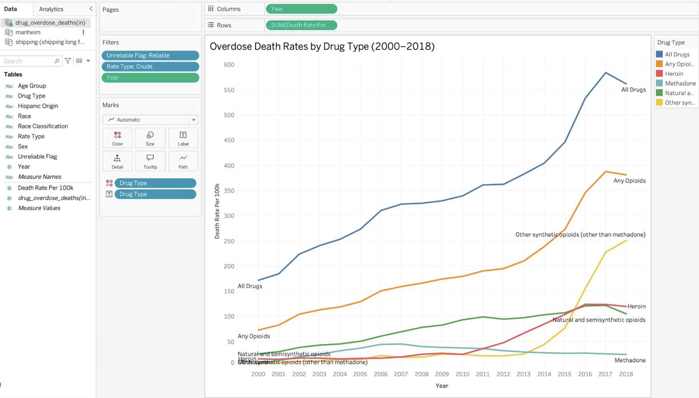
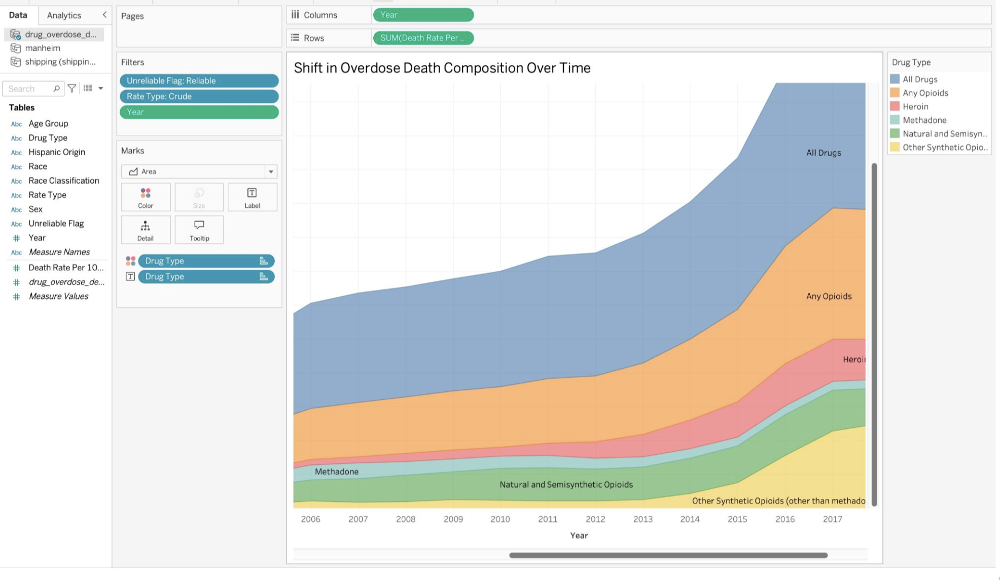
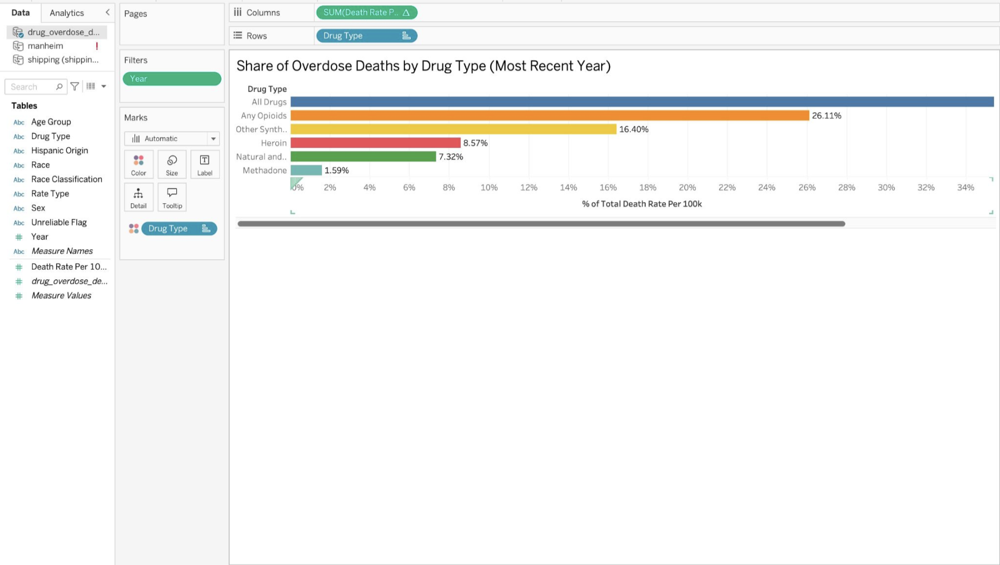

# MIST4610-Group-Project-2

## Team Name:
21479 Group 3

## Team Members:
1. Isabel Villaca [@icvillaca](https://github.com/icvillaca)
2. Carson Farris [@carsonf17](https://github.com/carsonf17)
3. Phoebe Prescott [@phoebeprescott](https://github.com/phoebeprescott)
4. Alexa Persad [@aepersad](https://github.com/aepersad)

## Overview of Data Set: 
The dataset used comes from the National Vital Statistics System (NVSS) published by the CDC’s National Center for Health Statistics (NCHS). The data was obtained [here](https://catalog.data.gov/dataset/drug-overdose-death-rates-by-drug-type-sex-age-race-and-hispanic-origin-united-states). The original dataset contains 6,228 rows and 15 columns. After cleaning up the dataset, it was reduced to 10 columns with the same 6,228 rows. Each row represents the drug overdose death rate for a specific combination of drug type, demographic group, and year. The field Drug_Type describes which drug was involved in the overdose, such as heroin, methadone, or synthetic opioids like fentanyl. The field Death_Rate_Per_100k provides the actual death rate measured as deaths per 100,000 resident population. Demographic breakdowns include Sex, Race, Hispanic_Origin, and Age_Group, which range from Under 15 years to 85 years and over. The dataset also includes a Rate_Type field which distinguishes between age-adjusted and crude rates, an Unreliable_Flag indicating whether the estimate met NCHS reliability standards, and a Race_Classification field identifying whether the race data uses multiple-race or single-race categories. Year is of data type number (whole), Death_Rate_Per_100k is of data type number (decimal), and all remaining fields are of data type string. 

## Question 1:
### How have overdose death rates changed over time across different drug types, and which drug type has driven recent increases?
**Importance:** This question is important because it takes a closer look at how overdose death rates have evolved in comparison to specific drug types. Drug use patterns shift over time due to social and behavioral factors. Socially, the rise in overdose death rates affects communities and this data helps identify which drugs populations are struggling with. There are also behavioral usage changes that have evolved during different time periods. This data set allows for a greater understanding and breaks down which drugs were used more frequently during a certain time period. Overall, analyzing and identifying which drug type is contributing to a rise in death rates can help healthcare providers design better intervention and prevention resources.

**Graphs 1 and 2 Analysis and Results:** Graph 1 & 2 show how overall drug overdose death rates have changed over time through 1999 to 2018. These graphs illustrate an increase in opioids, including synthetic (fentanyl), drug overdose deaths. We noticed a slight decrease in overdose deaths in methadone and heroin, and a larger decrease with natural/semisynthetic opioids. In the past heroin contributed to a greater majority of deaths due to being easier to access than prescription opioids. Heroin acted as a transition between prescription drugs and synthetic opioids(fentanyl), which is cheaper to produce and more potent for users.

**Graph 3 Analysis and Results:** Graph 3 visualizes the most recent year, 2018, and shows each drug type as a percentage of total overdose deaths. This helps identify which substances are currently making up the largest share of overdose deaths, and is the most up to date data. This graph shows that the drug overdose crisis is very much driven by opioids (26%), and is the largest group overall. The most important category for analysis is synthetic opioids(fentanyl), which is the most dangerous and fastest growing (supported by graph 1 & 2). The rise in synthetic opiods is an abnormal flucuation, implying the crisis is equally driven by the supply-side rather than exclusivley user behaviors. The main implications of this analysis is that public health care should focus on care for synthetic opioid use, while still paying attention to other drug types. Prevention and treatment efforts should focus on the psychological and physical effects for fentanyl to bring the biggest decrease in overdose deaths. This analysis is important because it connects overdose trends to real-world healthcare and policy decisions.

## Question 2:
### Which demographic groups (by age, race, or sex) have the highest overdose death rates, and how have these patterns changed over time? 
**Importance:** This is an important topic because this question illustrates real lives lost, not just statistics. By understanding how the death rates differ by age, race, or sex, we can see where the problem is the most severe. Then using that data, targeted efforts can be made to prevent overdoses. This matters because according to the data, drug overdose death rates are steadily increasing, meaning that without action, overdoses will continue to be one of the leading causes of preventable deaths in the United States.

 

**Graphs 1-3 Analysis and Results:** Based on the Tableau visualizations, the data reveals certain trends in overdose mortality in the U.S. from 1999 to 2018. Sheet 1 addresses how overdose deaths have affected males and females throughout the years. We can see that males have consistently died at around double the rate of females, with that gap widening after 2013 to 12 male deaths per 100k compared to the 6 female deaths for 100k. This significant difference likely stems from the stigma and lack of male treatment programs. According to the sheet 2 table, we can see that middle-aged adults are affected most by drug overdose mortalities. Between the ages of 35 and 54, the death rates are the highest at 8 deaths per 100k. Sheet 3 visualizes the overdose death rates by race. From this visualization we can see that the Native Hawaiian or Other Pacific Islander demographic group shows the highest death rate peak at 18-20 per 100k. This is followed by American Indian or Alaska native at around 8 per 100k. Native Hawaiian/Pacific Islander and American Indian/Alaska Native communities face rates 2–4x higher than the national average. These groups are more susceptible to drug overdoses because of underrepresentation in mainstream treatment programs and other barriers including geographic isolation and underfunded health facilities. Across all these groups, we can see how the overdose death rates continuously increase throughout the years. There is also a significant spike around 2012-2013, which correlates with the opioid epidemic in the United States. Ultimately, the data illustrates that overdose mortality is not uniform, but varies depending on demographics like age, sex, and race. Visualizing these inequities is important to account for who is most at risk and why, so targeted interventions can be made to prevent drug overdoses.

## Tableau Packaged Workbook: 

## Appendix:
**Data Cleaning Manipulations**

| # | Type | Original | Change |
|---|------|----------|--------|
| 1 | Rename | `PANEL` | Renamed to `Drug_Type` |
| 2 | Rename | `YEAR` | Renamed to `Year` |
| 3 | Rename | `AGE` | Renamed to `Age_Group` |
| 4 | Rename | `ESTIMATE` | Renamed to `Death_Rate_Per_100k` |
| 5 | Rename | `UNIT` | Renamed to `Rate_Type` |
| 6 | Rename | `FLAG` | Renamed to `Unreliable_Flag` |
| 7 | Recode | `UNIT` value | "Deaths per 100,000 resident population, age-adjusted" shortened to "Age-Adjusted" |
| 8 | Recode | `UNIT` value | "Deaths per 100,000 resident population, crude" shortened to "Crude" |
| 9 | Recode | `FLAG` value | Blank/null values recoded to "Reliable" |
| 10 | Recode | `FLAG` value | `*` values recoded to "Unreliable (*)" |
| 11 | Split | `STUB_LABEL` | Parsed into new `Sex` column |
| 12 | Split | `STUB_LABEL` | Parsed into new `Race` column |
| 13 | Split | `STUB_LABEL` | Parsed into new `Hispanic_Origin` column |
| 14 | Fill | `Sex` | Empty values filled with "All" |
| 15 | Fill | `Race` | Empty values filled with "All" |
| 16 | Fill | `Hispanic_Origin` | Empty values filled with "All" |
| 17 | Derive | `STUB_NAME` | New `Race_Classification` column created from existing values |
| 18 | Drop | `INDICATOR` | Removed — same value on every row |
| 19 | Drop | `PANEL_NUM` | Removed — redundant numeric sort key |
| 20 | Drop | `UNIT_NUM` | Removed — redundant numeric sort key |
| 21 | Drop | `STUB_NAME` | Removed — replaced by split columns |
| 22 | Drop | `STUB_NAME_NUM` | Removed — redundant numeric sort key |
| 23 | Drop | `STUB_LABEL` | Removed — replaced by split columns |
| 24 | Drop | `STUB_LABEL_NUM` | Removed — redundant numeric sort key |
| 25 | Drop | `YEAR_NUM` | Removed — redundant numeric sort key |
| 26 | Drop | `AGE_NUM` | Removed — redundant numeric sort key |

